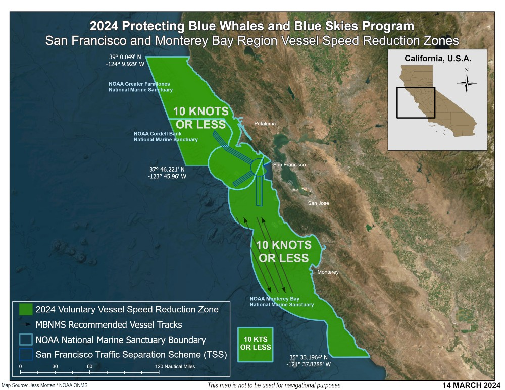
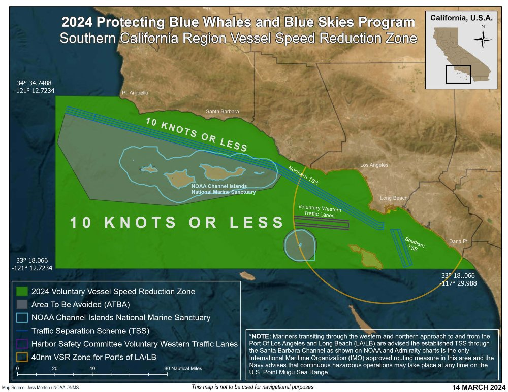
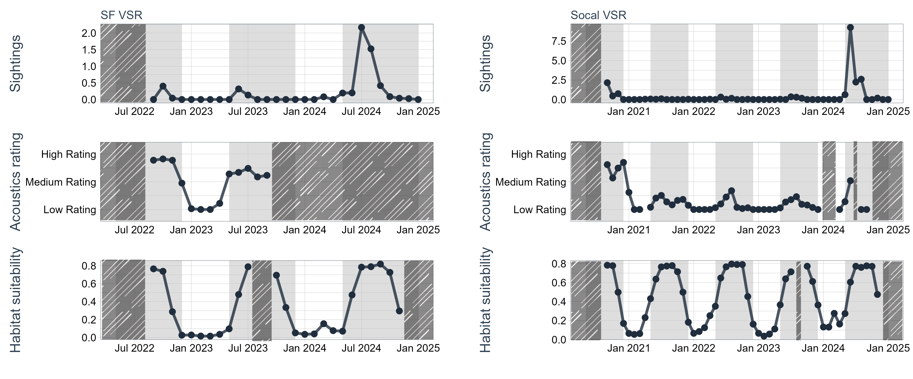

```{r}
#| warning: false
#| include: false
#| echo: false
#| label: libraries and data

library(tidyverse)
library(here)
library(tidyquant)
library(patchwork)
library(kableExtra) #table
library(webr) #donut plot
library(MetBrewer)
library(ggridges)
library(glmmTMB)
library(DHARMa)
set.seed(0902)

ms_theme <- function(){
  theme_tq() %+replace%
            theme(axis.title = element_text(size = 16), 
                  axis.text = element_text(size = 12, color = "black"), 
                  strip.text = element_text(size = 16, color = "white"), 
                  legend.title = element_text(size = 16), 
                  legend.text = element_text(size = 14))
}

# whale presence rating (wpr) data
# sf_wpr <- read.csv(here("data/wpr/sf_whale_data.csv"))
# socal_wpr <- read.csv(here("data/wpr/socal_whale_data.csv"))

#new data with raw acoustics percentages
sf_wpr <- read.csv(here("c:/Users/nazar/Documents/Projects/Impact_assessment_dom/data/wpr/sf_whale_data_updated_acoustics.csv"))
socal_wpr <- read.csv(here("c:/Users/nazar/Documents/Projects/Impact_assessment_dom/data/wpr/socal_whale_data_updated_acoustics.csv"))

wpr <- rbind(sf_wpr, socal_wpr)
wpr <- wpr %>%
  mutate(date_pt = as.Date(date_pt, format = "%m/%d/%Y"), 
         year = year(date_pt), 
         mo = month(date_pt),
         yr_mo = zoo::as.yearmon(date_pt), 
         id = paste0(date_pt, " ", zone))

#vessel speed reduction (vsr) data
mb_vsr <- read.csv(here("c:/Users/nazar/Documents/Projects/Impact_assessment_dom/data/vsr/monterey_vsr.csv")) 
sf_vsr <- read.csv(here("c:/Users/nazar/Documents/Projects/Impact_assessment_dom/data/vsr/sf_vsr.csv")) %>% mutate(cooperation = cooperation/100)
socal_vsr <- read.csv(here("c:/Users/nazar/Documents/Projects/Impact_assessment_dom/data/vsr/socal_vsr.csv")) %>% mutate(cooperation = cooperation/100)

vsr <- rbind(mb_vsr, sf_vsr, socal_vsr)
vsr <- vsr %>% 
  mutate(date = as.Date(date, format = "%m/%d/%Y"), 
         year = year(date), 
         mo = month(date),
         yr_mo = zoo::as.yearmon(date))

```

# Voluntary Vessel Speed Reduction (VSR) Zone & Whale Safe background

## VSR data notes

San Francisco data does not include the Monterey Bay National Marine Sanctuary, which was added to the VSR program in 2023. The Whale Safe system that was launched in San Francisco was designed to give whale presence in the San Francisco portion of the VSR zones so we are reporting on them separately here for now. The Monterey Bay stats come from a different data pipeline and the offseason stats are not tracked as regularly.

### **Whale Safe System Launch Dates**

Southern California: September 17, 2020

San Francisco: September 21, 2022

### **Vessel Speed Reduction Zones**

{fig-align="center" width="500"}

{fig-align="center" width="500"}

### **Vessel Speed Reduction Season Dates:**

Southern California:

-   June 4 - December 31, 2018:

-   May 15 - December 15, 2019

-   May 15 - December 15, 2020

-   May 15 - December 15, 2021

-   May 1 - December 15, 2022

-   May 1 - December 15, 2023

-   May 1 , 2024 - January 15, 2025

San Francisco

-   May 1 - November 15, 2019

-   May 1 - November 15, 2020

-   May 1 - November 15, 2021

-   May 1 - December 15, 2022

-   May 1 - December 15, 2023

-   May 1 , 2024 - January 15, 2025

## WPR data notes

Blue whale model data might have been retroactively filled in after periods where the server was down. We don’t have this tracked in our data so there may be days where the Whale Presence Rating didn’t take the blue whale model value into account.

Each species has a threshold for each data stream see [Methodology](https://whalesafe.com/methodology/) for what is considered low-high (0-1). The Whale Presence Rating considers the highest rating of any of the data streams over 5 days. Two species need to have a *high* rating in order for the overall Whale Presence Rating to be 'Very High'.

# Blue whale data stream time series

Across metrics, data points represent the year-month average for blue whales. Light grey shaded regions represent seasons when the VSR is active, while the striped regions represent when data was unavailable from the respective source.

For the acoustics panels, year-month averages were done by assigning a "Low Rating" a 1, a "Medium Rating" a 2, a "High Rating" a 3, and "offline" an NA. Then, averages were taken of these scores, and the means were plotted as they fit across the ranges of these three bins.

{fig-align="center"}

```{r}
#| warning: false
#| label: NA count blue data stream
#| echo: false

wpr_join <- readRDS(here(file = "c:/Users/nazar/Documents/Projects/Impact_assessment_dom/data/wpr_join.rds"))

sf_zone <- wpr_join %>% filter(zone == "SF VSR") %>% distinct(date_pt, .keep_all = TRUE)
sf_length <- length(unique(sf_zone$date_pt))

socal_zone <- wpr_join %>% filter(zone == "Socal VSR") %>% distinct(date_pt, .keep_all = TRUE)
socal_length <- length(unique(socal_zone$date_pt))

sf_ac_na <- as.data.frame(table(sf_zone$blue_acoustic)) %>%
  mutate(prop_time = Freq/sf_length)
socal_ac_na <- as.data.frame(table(socal_zone$blue_acoustic))%>%
  mutate(prop_time = Freq/socal_length)
#socal_zone %>% group_by(blue_acoustic) %>% summarise(n = n())

sf_ww_na <- as.data.frame(table(sf_zone$bwmv_rating)) %>%
  mutate(prop_time = Freq/sf_length)
socal_ww_na <- as.data.frame(table(socal_zone$bwmv_rating)) %>%
  mutate(prop_time = Freq/socal_length)

```

| Region (n = all days)          | Data system | Percent days offline |
|--------------------------------|:------------|:---------------------|
| San Francisco (n = 846)        | Acoustics   | 56.03%               |
| Southern California (n = 1579) | Acoustics   | 24.64%               |
| San Francisco (n = 846)        | Whale Watch | 20.09%               |
| Southern California (n = 1579) | Whale Watch | 11.40%               |

: Proportion of days per region data was offline

# Revised analysis: GLMM

## Sightings \~ SDM

```{r}
#| warning: false
#| label: glmm revise, sight ~ sdm

wpr <- wpr %>% mutate(j_day = format(date_pt, "%j"), 
                      blu_acou_deci = blue_acoustic_percent/100)

#sightings ~ sdm
sight_sdm <- glmmTMB(s_bluecount ~ bwmv + zone + mo + (1|year), 
                    ziformula = ~1,
                    family = poisson,
                    data = wpr)

summary(sight_sdm)
sight_sdm_resid <- simulateResiduals(sight_sdm)
plot(sight_sdm_resid)

# Create a prediction grid
pred_data <- expand.grid(
  bwmv = seq(min(wpr$bwmv, na.rm = TRUE), max(wpr$bwmv, na.rm = TRUE), length.out = 100),
  zone = unique(wpr$zone),   
  mo   = unique(wpr$mo),     
  year = NA                  # NA = exclude random effect
)

# Predict on the response scale
pred_data$fit <- predict(sight_sdm,
                         newdata  = pred_data,
                         type     = "response",  
                         re.form  = NULL)

ggplot(pred_data, aes(bwmv, fit)) + 
    geom_point()+
    facet_grid(zone~mo) + 
    ms_theme()

```

## Acoustics \~ SDM

```{r}
#| warning: false
#| label: glmm revise, acou ~ sdm

#acoustics ~ sdm
acou_sdm <- glmmTMB(blu_acou_deci ~ bwmv + zone + mo + (1|year), 
                    zi = ~1,
                    family = beta_family(link = "logit"),
                    data = wpr) 

summary(acou_sdm)
acou_sdm_resid <- simulateResiduals(acou_sdm)
plot(acou_sdm_resid)

# Create a prediction grid
pred_data <- expand.grid(
  bwmv = seq(min(wpr$bwmv, na.rm = TRUE), max(wpr$bwmv, na.rm = TRUE), length.out = 100),
  zone = unique(wpr$zone),   
  mo   = unique(wpr$mo),     
  year = NA                  # NA = exclude random effect
)

# Predict on the response scale
pred_data$fit <- predict(acou_sdm,
                         newdata  = pred_data,
                         type     = "response", 
                         re.form  = NULL)

ggplot(pred_data, aes(bwmv, fit)) + 
    geom_point()+
    facet_grid(zone~mo) + 
    ms_theme()
```